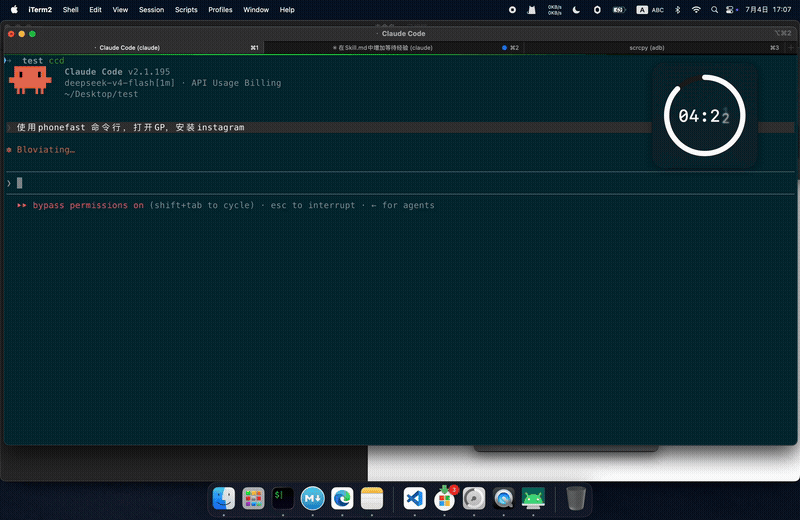

# phonefast — Fast Android Device Control

phonefast 是一个快速 Android 设备控制命令行工具，结合 scrcpy 视频流与手机友好的操作语义，支持 MCP 协议集成与本地 CLI 两种使用方式。

**核心特性：**
- 🚀 **Daemon 模式** — 后台常驻进程，Unix Socket JSON-RPC，命令即时响应
- 📱 **直接模式** — 无 daemon，每次新建连接，适合临时操作
- 🔌 **MCP 协议** — SSE / STDIO 双传输，AI 助手可直接控制手机
- 💓 **三层保活** — TCP Keepalive + 应用心跳 + 写触发，断线 10 秒内自动重连
- 📝 **异步日志** — 协程式文件写入，记录所有关键操作与函数上下文

---

## 演示



> **4倍速** — Claude Code + phonefast 真实执行过程。  
> Prompt: `使用phonefast skill，打开GP 安装Instagram`

---

## 性能

phonefast daemon 模式在所有操作上均保持稳定低延迟。以下数据来自 **12 小时长稳压测**（v1.0.11，145,843 次操作，100% 成功率，零断连）：

| 操作 | P50 | P95 | P99 | 说明 |
|------|:---:|:---:|:---:|------|
| `tap` | **13ms** | 13ms | 14ms | 坐标点击 |
| `back` / `home` / `press_key` | **12-13ms** | 13ms | 14ms | 硬件按键 |
| `screenshot` | **28ms** | 126ms | 128ms | H.264 关键帧 → PNG |
| `observe` | **28ms** | 126ms | 129ms | 截图 + UI（原子操作） |
| `get_ui_elements` | **46ms** | 132ms | 151ms | UI 树（UISocketHandler） |
| `swipe` | **318ms** | 322ms | 323ms | 滑动（含 300ms 时长） |
| `type_text` / `launch_app` / `status` | **1ms** | 1-2ms | 2-4ms | 即发即弃语义 |
| `wait` | **33ms** | 33ms | 33ms | 等待命令 |

**关键指标：**
- Daemon 模式触控延迟：**<13ms**
- 截图 P50：**28ms**（比 v1.0.0 的 121ms 快 **4.3 倍**）
- 真实物理内存：**~16MB** 稳态（vmmap 验证）
- 12 小时压测：**145,843 次操作、100% 成功、0 次断连**
- 连续 200 次截图：**P50 = 12ms、P95 = 13ms**（解码器热机后）

> 完整 benchmark 历史、版本对比和测试方法详见 [docs/benchmark.md](docs/benchmark.md)。

---

## 快速上手

### 安装

**前置依赖：** Go 1.21+、`adb`、`ffmpeg`、`git`

```bash
# 从源码构建
bash scripts/build.sh                       # 当前平台
bash scripts/build.sh --all                 # 全平台构建 + 打包

# 或从 GitHub Releases 下载预编译二进制
# https://github.com/gezihua123/phonefast/releases
```

> 构建细节（交叉编译、FFmpeg 静态链接）→ [docs/DEV.md](docs/DEV.md)

### 快速开始

```bash
# 查看连接的设备
phonefast devices

# 默认 daemon 模式 — 即时响应（<10ms）
phonefast tap 540 960
phonefast back
phonefast screenshot /tmp/screen.png

# 直接模式 — 每次新建连接（~2.5s），加 --foreground
phonefast --foreground tap 100 200

# 启动 MCP 服务器（供 AI 助手使用）
phonefast serve
```

---

## 命令参考

### 格式说明

```bash
phonefast [--foreground|--daemon] <command> [args...]
```

- 默认使用 daemon 模式（自动启动 daemon），延迟 <10ms。
- `--foreground` / `--direct` — 直接模式，每次新建 scrcpy 连接，~2.5s。
- `--daemon` — 显式指定 daemon 模式（与默认行为相同，保留用于兼容）。

---

### 触摸操作

#### `tap` — 点击坐标

```bash
phonefast [--foreground|--daemon] tap <x> <y>
```

| 参数 | 描述 |
|------|------|
| `x` | X 坐标（像素） |
| `y` | Y 坐标（像素） |

```bash
phonefast tap 540 960                 # 点击屏幕中心
phonefast --foreground tap 100 200    # 直接模式
```

#### `tap_element` — 点击 UI 元素

```bash
phonefast [--foreground|--daemon] tap_element <index|text>
```

| 参数 | 描述 |
|------|------|
| `index` | UI 元素索引（来自 `ui` 命令） |
| `text` | UI 元素文本或描述（模糊搜索） |

```bash
phonefast tap_element 5              # 点击第 5 个 UI 元素
phonefast tap_element "Settings"    # 点击文本含 "Settings" 的元素
```

#### `swipe` — 滑动手势

```bash
phonefast [--foreground|--daemon] swipe <x1> <y1> <x2> <y2> [duration_ms]
```

| 参数 | 描述 | 默认值 |
|------|------|--------|
| `x1` `y1` | 起始坐标 | — |
| `x2` `y2` | 终点坐标 | — |
| `duration_ms` | 滑动时长（毫秒） | 500 |

```bash
phonefast swipe 540 1600 540 400 500   # 向上滑动
phonefast swipe 200 500 800 500 300    # 向右滑动 300ms
```

---

### 文本输入

#### `type` — 输入文本

```bash
phonefast [--foreground|--daemon] type <text>
```

在当前焦点输入框中输入文本。

```bash
phonefast type "Hello World"
phonefast type "搜索关键词"
```

---

### 按键操作

#### `back` — 返回键

```bash
phonefast [--foreground|--daemon] back
```

#### `home` — Home 键

```bash
phonefast [--foreground|--daemon] home
```

#### `key` — 发送按键

```bash
phonefast [--foreground|--daemon] key <keyname|keycode>
```

**支持的键名：**

| 键名 | 说明 |
|------|------|
| `enter` | 回车 |
| `tab` | Tab 键 |
| `delete` / `backspace` | 删除 |
| `space` | 空格 |
| `escape` / `esc` | Esc 键 |
| `volume_up` / `volume_down` | 音量+/- |
| `volume_mute` | 静音 |
| `power` | 电源键 |
| `menu` | 菜单键 |
| `search` | 搜索键 |
| `camera` | 相机键 |
| `back` | 返回（同 back 命令） |
| `home` | Home（同 home 命令） |
| `dpad_up` / `dpad_down` / `dpad_left` / `dpad_right` / `dpad_center` | 方向键 |
| `page_up` / `page_down` | 翻页 |
| `media_play_pause` / `media_stop` / `media_next` / `media_previous` | 媒体控制 |

```bash
phonefast key enter
phonefast key backspace
phonefast key volume_up
phonefast key power
phonefast key dpad_down

# 也可以直接用键码
phonefast key 4       # BACK
phonefast key 3       # HOME
phonefast key 66      # ENTER
```

---

### 应用操作

#### `launch` — 启动应用

```bash
phonefast [--foreground|--daemon] launch <package>
```

需要通过 Android 包名指定（不支持应用显示名，如"设置"、"Chrome"）。

```bash
phonefast launch com.android.settings     # 设置
phonefast launch com.android.chrome        # Chrome
phonefast launch com.tencent.mm             # 微信
```

---

### 屏幕捕获与分析

#### `screenshot` — 截图

```bash
phonefast [--foreground|--daemon] screenshot [file]
```

| 参数 | 描述 | 默认值 |
|------|------|--------|
| `file` | 保存路径 | stdout（base64） |

```bash
phonefast screenshot /tmp/screen.png       # 保存为 PNG
phonefast screenshot                        # 输出 base64
```

#### `ui` — UI 元素列表

```bash
phonefast [--foreground|--daemon] ui
```

输出当前屏幕所有可交互 UI 元素（最多显示 50 个），包括索引、文本、资源 ID、类名、可点击状态。

```
[0] id="content" (FrameLayout)
[1] id="webView" (FrameLayout)
[2] text="搜索" (EditText) [clickable]
[3] text="设置" id="settings_btn" (Button) [clickable]
```

#### `observe` — 截图 + UI

```bash
phonefast [--foreground|--daemon] observe
```

并行使截图与 UI 采集，一次调用获取完整屏幕状态。

---

### 工具命令

#### `wait` — 等待

```bash
phonefast [--foreground|--daemon] wait <ms>
```

| 参数 | 描述 | 默认值 |
|------|------|--------|
| `ms` | 等待毫秒数 | 1000 |

#### `status` — Daemon 状态

```bash
phonefast [--foreground|--daemon] status
```

```bash
# 示例输出
daemon running (pid 60977)
  device:    13709314CF044927 (488x1080)
  control:   true
  ui:        true
```

#### `devices` — 设备列表

```bash
phonefast devices
```

```bash
# 示例输出
Connected devices:
  13709314CF044927  device  [TECNO_KL8h]
```

#### `run` — JSON 单次操作

```bash
phonefast [--foreground|--daemon] run '<json>'
```

适用于脚本自动化调用。

```bash
phonefast run '{"action":"tap","args":{"x":540,"y":960}}'
phonefast run '{"action":"screenshot"}'
phonefast run '{"action":"back"}'
phonefast run '{"action":"list_devices"}'
```

支持的 action：`tap`, `tap_element`, `swipe`, `back`, `home`, `type_text`, `press_key`, `launch_app`, `screenshot`, `get_ui_elements`, `observe`, `list_devices`, `wait`。

---

## Daemon 管理

Daemon 是一个后台常驻进程，持有设备的长连接，通过 Unix Socket 接收 JSON-RPC 请求。

```bash
# 启动 daemon（后台运行）
phonefast daemon

# 前台运行（查看实时日志）
phonefast daemon --foreground

# 指定设备序列号
phonefast daemon --serial 13709314CF044927

# 自定义 socket/PID 文件路径
phonefast daemon --socket /tmp/my-phone.sock

# 查看 daemon 状态
phonefast daemon --status

# 停止 daemon
phonefast daemon --stop
```

**自动管理：**
- 使用 `--daemon` 标志执行命令时，如果 daemon 未运行，会自动在后台启动
- 如果 daemon 进程存在但无响应，会自动杀死并重启
- 多次调用 `phonefast daemon` 不会重复启动（已运行则退出）
- 三层保活机制检测连接异常，10 秒内自动恢复

> 详细 daemon 生命周期、启动流程和故障恢复 → [docs/CLI.md#5-daemon-管理](docs/CLI.md)

---

## MCP 服务器

phonefast 可作为 MCP (Model Context Protocol) 服务器，供 Claude Desktop 等 AI 助手直接控制手机。

```bash
# SSE 模式（默认端口 8019）
phonefast serve

# 自定义端口
phonefast serve --port 8080

# 自定义路径
phonefast serve --path /mcp

# STDIO 模式（Claude Desktop 集成）
phonefast serve --transport stdio
```

### 客户端配置

**SSE 模式：**
```json
{
  "mcpServers": {
    "phonefast": {
      "url": "http://localhost:8019/Phone/sse"
    }
  }
}
```

**STDIO 模式：**
```json
{
  "mcpServers": {
    "phonefast": {
      "command": "phonefast",
      "args": ["serve", "--transport", "stdio"]
    }
  }
}
```

### MCP 工具列表

| 工具 | 参数 | 说明 |
|------|------|------|
| `list_devices` | — | 列出已连接的 Android 设备 |
| `screenshot` | — | 截取当前屏幕（base64 PNG） |
| `get_ui_elements` | — | 获取可交互 UI 元素 |
| `observe` | — | 截图 + UI 元素（一次调用） |
| `tap` | `x`, `y` | 点击坐标 |
| `tap_element` | `index` 或 `text` | 点击 UI 元素 |
| `swipe` | `start_x`, `start_y`, `end_x`, `end_y`, `duration_ms` | 滑动手势 |
| `type_text` | `text` | 输入文本 |
| `back` | — | 返回键 |
| `home` | — | Home 键 |
| `press_key` | `keycode` 或 `key` | 发送按键 |
| `launch_app` | `package` | 启动应用（仅包名，如 `com.android.settings`） |
| `wait` | `duration_ms` | 等待 N 毫秒 |

---

## 两种模式对比

| | Daemon 模式 | 直接模式 |
|------|-------------|----------|
| 命令格式 | `phonefast <cmd>`（默认） | `phonefast --foreground <cmd>` |
| 响应速度 | <10ms | ~2.5s |
| 资源占用 | 后台常驻一个 daemon 进程 | 每次新建/销毁连接 |
| 适用场景 | 批量操作、脚本自动化 | 临时单次操作 |
| 自动管理 | 自动启动/重启/恢复 | 无状态 |

---

## 参考文档

| 文档 | 内容 |
|------|------|
| [docs/CLI_zh.md](docs/CLI_zh.md) | 完整 CLI 手册：安装、命令、Daemon、MCP、架构、日志、故障恢复 |
| [docs/DEV_zh.md](docs/DEV_zh.md) | 开发笔记：架构决策、构建与发布、交叉编译 |
| [docs/benchmark_zh.md](docs/benchmark_zh.md) | 完整 benchmark 历史：版本对比、测试方法、内存分析 |
| [docs/phonefast_zh.md](docs/phonefast_zh.md) | 产品对比：phonefast vs agent-device vs adb |
| [CHANGELOG.md](CHANGELOG.md) | 版本发布历史 |

---

## License

MIT
