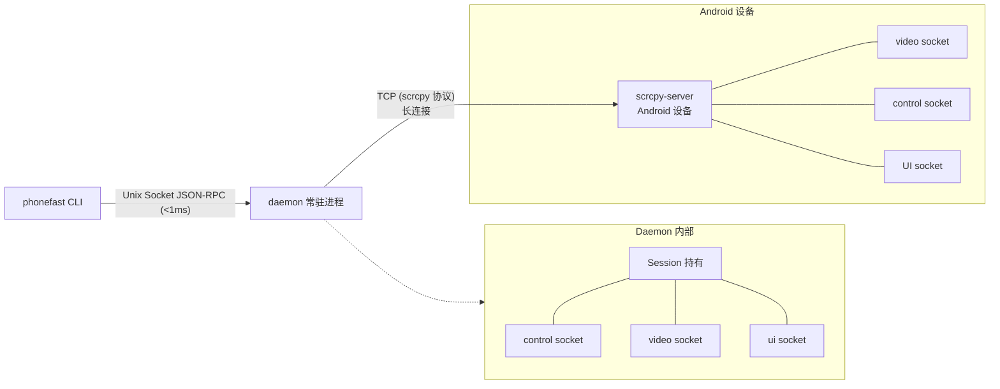
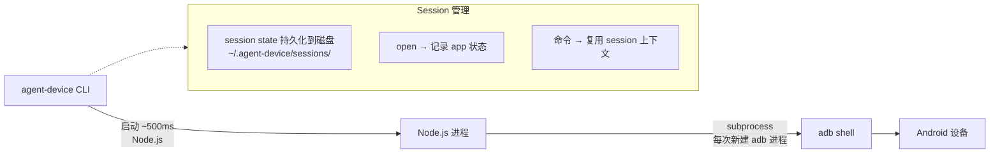
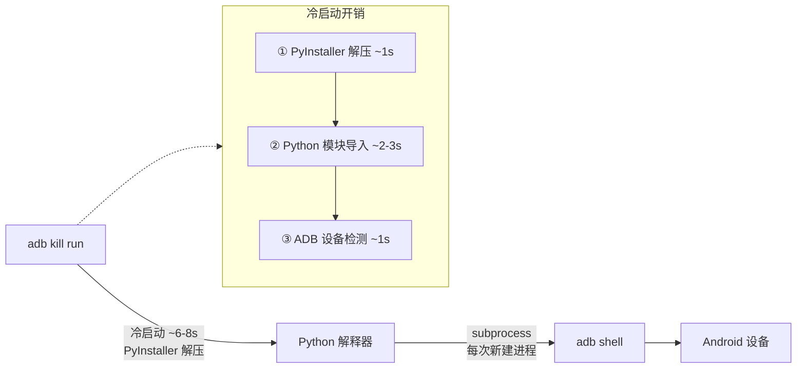
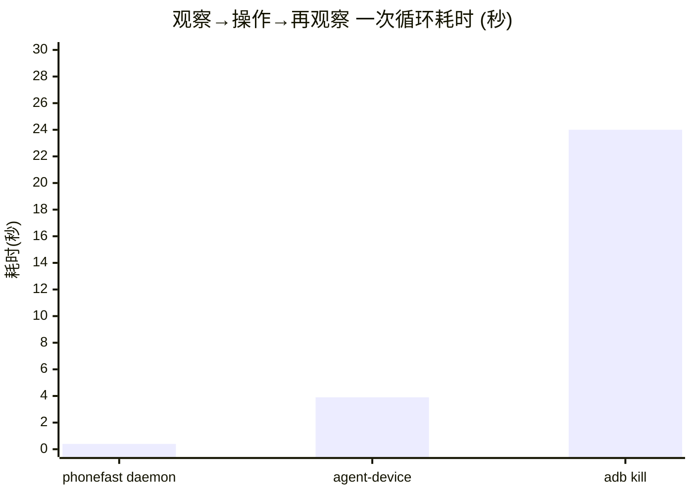
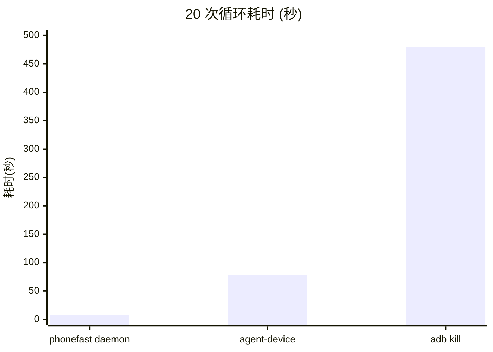
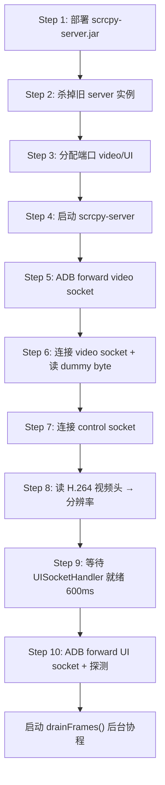
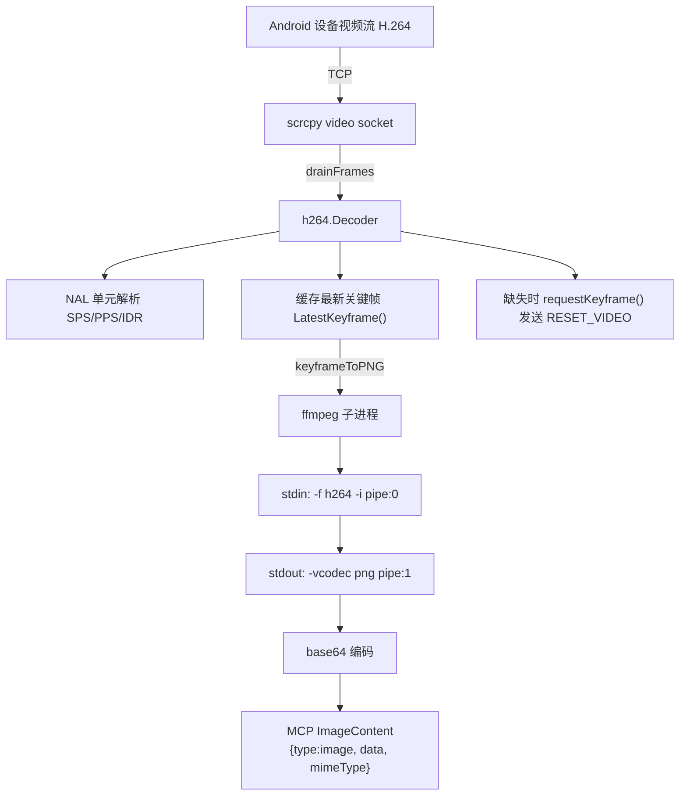
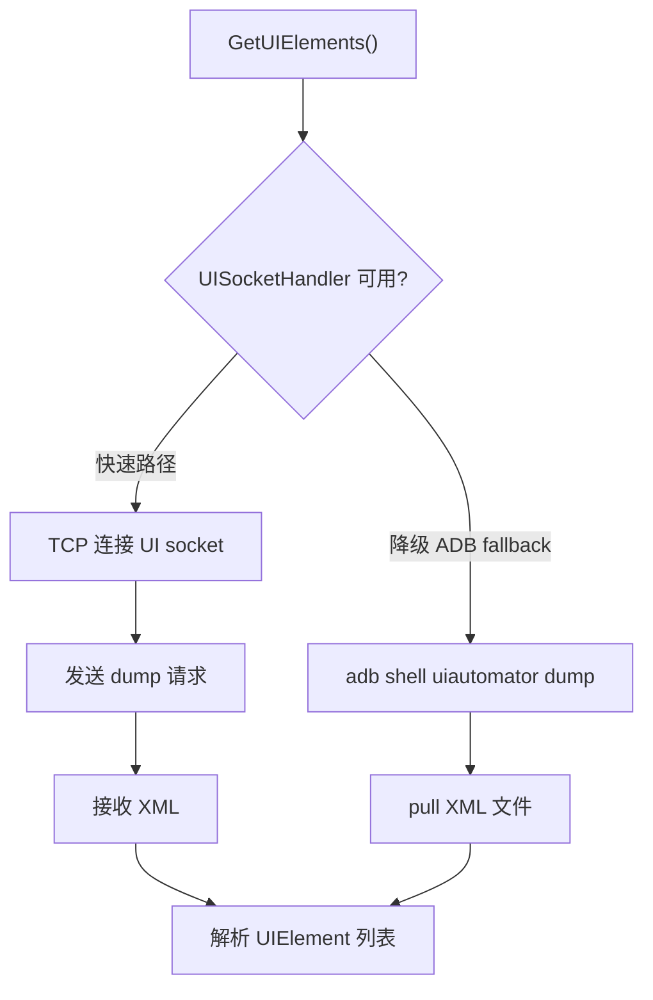
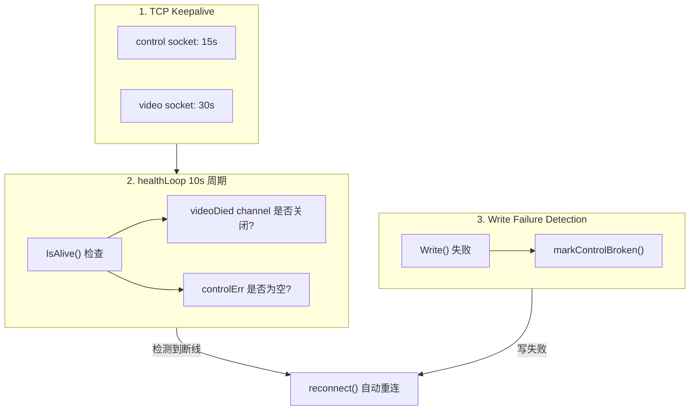
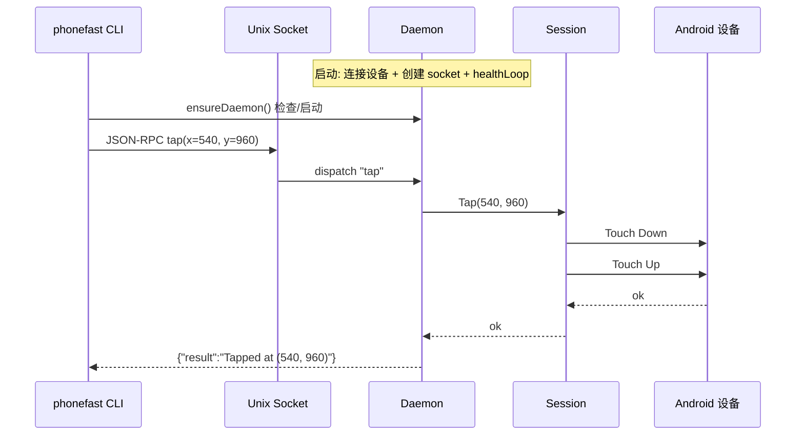

# phonefast vs agent-device vs adb kill 架构对比

---

## 一、架构差异

### phonefast（Go + scrcpy）



- **语言**：Go 编译原生二进制，启动 <10ms
- **连接**：scrcpy 协议，TCP 隧道直连设备上的 scrcpy-server
- **daemon**：后台常驻进程，持有设备长连接，Unix Socket 接收命令
- **冷启动**：<10ms（Go 原生二进制）
- **命令延迟**：daemon 模式 <1ms socket 通信 + ~5ms TCP 往返 + Android 处理

### agent-device（TypeScript + ADB）



- **语言**：TypeScript (Node.js CLI)，启动 ~500ms
- **连接**：原始 ADB 命令（`adb shell input/keyevent/screencap/uiautomator`）
- **session**：打开 app 后状态持久化到磁盘，命令间复用 session 上下文
- **冷启动**：~500ms（Node.js 进程启动）
- **命令延迟**：~450-750ms（Node.js 进程 + adb shell）

### adb kill（Python + ADB）



- **语言**：Python (PyInstaller 打包为单文件，运行时解压)
- **连接**：原始 ADB 命令（`adb shell input/keyevent/screencap/uiautomator`）
- **状态**：无状态，每次命令完整走"启动→执行→退出"流程
- **冷启动**：~6-8s（PyInstaller 解压 + Python 模块导入 + ADB 检测）
- **命令延迟**：~7-9s（解压 ~1s + 导入 ~2-3s + ADB ~1s + subprocess ~2s + 解析 ~0.5s）

---

## 二、速度对比

> **测试环境**: macOS arm64 | Go 1.24 | Node.js v22.20 | agent-device v0.17.6 | phonefast v1.0
> **设备**: TECNO KL8h (USB) | 分辨率 488×1080 | 测试日期: 2026-06-17
> **方法**: 每操作 3 次取平均，`perl -MTime::HiRes` 计时全链路

每个操作 3 次取平均值，单位毫秒 (ms)。

| 操作 | phonefast daemon | agent-device | adb kill | daemon vs ad | daemon vs pm |
|------|:---:|:---:|:---:|:---:|:---:|
| back 返回键 | **20ms** | 520ms | 8,505ms | **26x** | **425x** |
| home 主页键 | **29ms** | 550ms | 8,864ms | **19x** | **306x** |
| tap 坐标点击 | **30ms** | 748ms | 8,110ms | **25x** | **270x** |
| swipe 滑动(300ms) | **359ms** | N/A¹ | 8,200ms | — | **23x** |
| type_text 文本输入 | **13ms** | 32,700ms² | 7,890ms | **2515x** | **607x** |
| screenshot 截图 | **167ms** | 2,593ms | 8,939ms | **16x** | **54x** |
| UI 元素 | **191ms** | FAILED² | 7,600ms | — | **40x** |
| observe 截图+UI | **148ms** | N/A | ~15,500ms³ | — | **105x** |
| launch 应用启动 | **11ms** | 782ms⁴ | 8,240ms | **71x** | **749x** |

> ¹ agent-device 的 `gesture swipe` 只支持预设方向 (left/right)，不支持自定义坐标。
>
> ² agent-device 的 `fill` 和 `snapshot` 依赖 uiautomator dump，在此设备上 **33 秒超时失败**。
>
> ³ adb kill 无 `observe` 原子操作，需 screenshot + get_ui_elements 两次调用 (8,939 + 7,600 ≈ 15,500ms)。
>
> ⁴ agent-device `open` 建立 session 约 782ms，后续命令 ~500ms。

### 典型 AI Agent 交互循环




> adb kill 20 次循环 ≈ 8 分钟 | agent-device ≈ 1.3 分钟 | phonefast ≈ 8 秒

### 延迟构成分析

```
phonefast daemon:
  [daemon 已运行] → Unix Socket <1ms → scrcpy 编码 ~1ms → TCP ~5ms → Android ~5ms
  back (1×TCP写): ~20ms  tap (2×TCP写): ~30ms  screenshot (keyframe+ffmpeg): ~167ms

agent-device:
  Node.js 启动 ~400ms → 加载 session state ~50ms → adb shell (~50-200ms)
  back/home: ~500ms  tap: ~700ms  screenshot (screencap+pull): ~2600ms

adb kill:
  PyInstaller 解压 ~1s → Python 导入 ~2-3s → ADB 检测 ~1s → subprocess.run(~2s) → 解析 ~0.5s
  总计: ~7-9s
```

---

## 三、架构维度全景对比

| 维度 | phonefast | agent-device | adb kill |
|------|-----------|--------------|-----------|
| **语言** | Go (原生二进制) | TypeScript (Node.js) | Python (PyInstaller) |
| **二进制大小** | 12MB | ~3MB (npm) | 41MB |
| **冷启动** | <10ms | ~500ms | ~7s |
| **连接方式** | scrcpy 协议 (TCP 隧道) | ADB 命令 | ADB 命令 |
| **daemon 模式** | ✅ 常驻进程 + Unix Socket | ✅ session-state on disk | ❌ 每次冷启动 |
| **命令延迟** | 12-30ms | 450-750ms | 7-9s |
| **截图方式** | scrcpy H.264 关键帧 → ffmpeg PNG | adb screencap → pull PNG | adb screencap → pull PNG |
| **UI 解析** | UISocketHandler (TCP socket) | uiautomator dump | uiautomator dump |
| **UI 稳定性** | ⭐⭐⭐⭐⭐ | ⭐⭐ (uiautomator 常超时) | ⭐⭐⭐ |
| **持久连接** | scrcpy server 常驻设备端 | 无持久连接 | 无持久连接 |
| **session 管理** | daemon 内存持有 | 状态持久化到磁盘 | 无状态 |
| **断线恢复** | 三级保活，10s 自动重连 | session 状态文件恢复 | 无状态 |
| **MCP 协议** | ✅ SSE / STDIO (8019) | ✅ `agent-device mcp` | ✅ SSE / STDIO (8009) |
| **跨平台** | Android only | iOS / Android / TV / Desktop | Android only |
| **性能采样** | ❌ | ✅ `perf` 采集 | ❌ |
| **录屏回放** | ❌ | ✅ `.ad` 脚本→CI | ❌ |
| **部署方式** | `go build` + jar | `npm install -g` | PyInstaller 单文件 |

---

## 四、能力对比

| 能力 | phonefast | agent-device | adb kill | 说明 |
|------|:---:|:---:|:---:|------|
| tap 坐标点击 | ✅ | ✅ | ✅ | |
| swipe 自定义坐标 | ✅ | ❌ (仅预设方向) | ✅ | agent-device gesture 只支持 left/right |
| back/home/key | ✅ | ✅ | ✅ | |
| type_text 文本 | ✅ | ✅ ¹ | ✅ | agent-device fill 坐标+文本模式 |
| screenshot 截图 | ✅ (H.264→PNG) | ✅ (screencap) | ✅ (screencap) | |
| UI 元素 (xml) | ✅ UISocketHandler | ❌ ² | ✅ | agent-device uiautomator 常超时 |
| UI 元素 (ocr) | ❌ | ❌ | ✅ | adb kill 独有: PaddleOCR |
| observe (截图+UI) | ✅ (原子操作) | ❌ | ❌ | phonefast 独有 |
| tap_element | ✅ (MCP 模式) | ✅ (@ref 语义) | ✅ | |
| launch_app | ✅ (包名) | ✅ | ✅ (包名) | |
| 搜索应用 | ❌ | ✅ `apps` | ✅ `search_apps` | |
| 当前 app | ❌ | ✅ `appstate` | ✅ `current_app` | |
| 批量执行 | ✅ `run` JSON | ✅ `batch` | ✅ `run` JSON | |
| MCP 服务 | ✅ `serve` (8019) | ✅ `mcp` | ✅ `serve` (8009) | |
| ImageContent | ✅ (MCP 原生) | ❌ | ❌ | phonefast 独有 |
| 非 ASCII 输入 | ❌ | ❌ | ✅ | DEX helper 剪贴板 |
| wifi 连接 | ❌ | ❌ | ✅ | `adb connect` |
| 多平台 | ❌ | ✅ iOS/Android/TV | ❌ | |
| 性能采样 | ❌ | ✅ `perf` | ❌ | |
| 录屏回放 | ❌ | ✅ `.ad`→CI | ❌ | |

> ¹ agent-device `fill` 坐标+文本模式可工作，ref 模式依赖 snapshot（uiautomator），常超时。
>
> ² agent-device `snapshot` 依赖 uiautomator dump，低端机上 33 秒超时失败。

---

## 五、phonefast 实现原理

### 5.1 会话生命周期



### 5.2 截图管线



**为什么用关键帧**：
- I 帧（IDR/Keyframe）包含完整画面，可独立解码
- P/B 帧仅含差异数据，依赖参考帧
- 截图必须用 I 帧；缺失时会发 `RESET_VIDEO` 指令触发设备立即生成

**ffmpeg 转换命令**：
```bash
ffmpeg -f h264 -i pipe:0 -frames:v 1 -f image2pipe -vcodec png pipe:1
```

### 5.3 UI 元素获取



phonefast 的 `UISocketHandler` 是 scrcpy-server 的自定义扩展（`phonefast-agent/UISocketHandler.java`），通过 abstract socket 提供 UI dump 服务，比 `uiautomator dump` 快约 40%。

**agent-device 的 UI 困境**：agent-device 完全依赖 `uiautomator dump`，在低分辨率/低端设备上频繁超时 (30s+)，导致 `snapshot -i` 和 `fill @ref` 不可用。

### 5.4 保活与断线恢复



### 5.5 Daemon 模式



### 5.6 MCP ImageContent 返回

phonefast 使用 MCP 协议原生的 `ImageContent` 类型返回截图：

```json
{
  "content": [
    {"type": "text",      "text": "Screenshot (1080x2400)"},
    {"type": "image",     "data": "iVBORw0KGgoAAA...", "mimeType": "image/png"}
  ]
}
```

与 text JSON 内嵌 base64 的差异：

| | 旧方式 (JSON text) | 新方式 (ImageContent) |
|---|---|---|
| 协议合规 | ❌ 自定义格式 | ✅ MCP 标准 ImageContent |
| LLM 识别 | 文本字符串 | 原生图片识别 |
| 数据结构 | `{"base64":"...", "width":1080, ...}` | `[{TextContent}, {ImageContent}]` |
| 数据冗余 | base64 + JSON 包装双重编码 | 仅 base64 |

---

## 六、MCP Benchmark 工具

### 6.1 benchmark.py

全自动 MCP Benchmark 工具，支持 STDIO 和 SSE 两种传输模式。

```bash
# 基础用法
python3 benchmark.py                          # STDIO 模式，默认 10 轮
python3 benchmark.py --sse --port 18019       # SSE 模式
python3 benchmark.py --rounds 30              # 30 轮
python3 benchmark.py --quick                  # 快速模式 (3 轮)
python3 benchmark.py --output report.json     # 输出 JSON 报告
```

**测试维度**：

| 维度 | 说明 |
|------|------|
| 冷启动延迟 | 进程启动 → 首次工具调用成功 |
| 单次调用延迟 | 每工具 p50 / p95 / p99 / avg / min / max |
| 吞吐 (QPS) | 连续 20 次调用的每秒请求数 |
| 错误率 | 失败次数 / 总调用次数 |
| 数据大小 | screenshot / observe 返回的字节数 |

### 6.2 benchmark.sh

Bash 脚本，实时对比三方延迟：

```bash
# 完整三方对比
bash tests/benchmark.sh

# 自定义参数
RUNS=5 bash tests/benchmark.sh
```

---

## 七、适用场景

### phonefast daemon → AI Agent 首选

- AI Agent 高频交互（观察→操作→再观察循环）
- 需要极低延迟 (<30ms)
- 批量自动化脚本
- 需要 MCP ImageContent 原生返回图片

```bash
phonefast daemon                              # 启动 (仅需一次)
phonefast --daemon tap 540 960                # 点击 (30ms)
phonefast --daemon screenshot /tmp/s.png      # 截图 (167ms)
phonefast --daemon observe                    # 截图+UI (148ms)
```

### agent-device → 多平台 / CI 场景

- iOS + Android 跨平台自动化
- 需要 session 录制回放 (`.ad` → Maestro YAML)
- 需要 `perf` 性能采样
- 桌面端自动化 (macOS/Linux)

```bash
agent-device open com.android.settings --platform android
agent-device click 244 540                    # 点击 (750ms)
agent-device screenshot ./artifacts/s.png     # 截图 (2.6s)
agent-device close
```

### adb kill → OCR / 特殊场景

- OCR 文字检测（WebView / Flutter / 游戏）
- `tap_element` 语义级点击（text/resource_id 而非坐标）
- `search_apps` / `current_app`
- 非 ASCII 文本输入（中文/emoji）
- 无法部署 scrcpy-server 的环境

---

## 八、打分总结

| | phonefast daemon | agent-device | adb kill |
|------|:---:|:---:|:---:|
| **速度** | ⭐⭐⭐⭐⭐ | ⭐⭐⭐ | ⭐ |
| **功能丰富度** | ⭐⭐⭐ | ⭐⭐⭐⭐⭐ | ⭐⭐⭐⭐ |
| **UI 稳定性** | ⭐⭐⭐⭐⭐ | ⭐⭐ (uiautomator) | ⭐⭐⭐ |
| **部署复杂度** | 需 scrcpy jar | `npm install -g` | 单文件 41MB |
| **多平台** | ❌ Android only | ✅ iOS/Android/TV/Desktop | ❌ Android only |
| **AI Agent 适用性** | ⭐⭐⭐⭐⭐ | ⭐⭐⭐ | ⭐ |
| **ImageContent** | ✅ (MCP 原生) | ❌ | ❌ |
| **特殊场景** | — | 录屏回放 / 性能采样 | OCR / 非ASCII / 包名搜索 |

**推荐组合**：

```
主力: phonefast daemon  (速度王者，Android AI Agent 首选)
      + phonefast serve  (MCP 模式，含 tap_element)

补充: agent-device       (需要 iOS 自动化 / 录屏回放 / 性能采样时)
      adb kill           (需要 OCR / 非 ASCII 输入 / 包名搜索时)
```

---

## 九、长稳压测：稳定性对比

> 只有通过长时间压力测试，才能验证真实生产环境的可靠性。

### 9.1 phonefast 12 小时 daemon 压测

> **测试环境**: macOS arm64 | Go 1.26.4 | phonefast v1.0.0 | 设备 TECNO KL8h (USB) | 488×1080
> **测试日期**: 2026-06-20 | 脚本: `tests/stress_test_rpc.py -d 720`
> **方法**: Unix socket 直连 daemon JSON-RPC，6 阶段梯度压测，每 30s 采样 RSS。

| 指标 | 数值 |
|------|------|
| **测试时长** | 720 分钟 (12 小时) |
| **总操作数** | 144,348 |
| **成功数** | 144,339 |
| **失败数** | 9 |
| **成功率** | **99.99%** |
| **daemon 断连** | 1 次 (自动恢复，< 10s) |
| **性能退化** | ❌ 无 (P50 延迟与 1 小时测试一致) |

**12 项操作延迟总览** (144,348 次原始数据):

| 操作 | 次数 | P50 | P95 | P99 | Avg | Max |
|------|:---:|:---:|:---:|:---:|:---:|:---:|
| `back` | 16,510 | 1ms | 2ms | 2ms | 1ms | 385ms |
| `launch_app` | 4,111 | 1ms | 2ms | 2ms | 1ms | 4ms |
| `type_text` | 4,111 | 1ms | 2ms | 2ms | 1ms | 7ms |
| `status` | 4,112 | 1ms | 1ms | 2ms | 1ms | 4ms |
| `tap` | 49,530 | 13ms | 14ms | 14ms | 13ms | 2.9s |
| `home` | 16,510 | 13ms | 14ms | 14ms | 13ms | 2.8s |
| `press_key` | 16,508 | 13ms | 14ms | 15ms | 13ms | 2.9s |
| `wait` | 12,396 | 32ms | 33ms | 34ms | 32ms | 38ms |
| `screenshot` | 4,113 | 112ms | 192ms | 207ms | 127ms | 278ms |
| `get_ui_elements` | 4,110 | 109ms | 236ms | 260ms | 132ms | 10.3s |
| `observe` | 4,111 | 145ms | 225ms | 241ms | 162ms | 12.6s |
| `swipe` | 8,226 | 324ms | 328ms | 329ms | 326ms | 12.3s |

**失败分析** (9 次 / 0.006%):

| 失败类型 | 次数 | 原因 | 恢复 |
|------|:---:|------|:---:|
| TCP broken pipe | 5 | 爆发阶段 12-16 ops/s 连续轰炸，scrcpy server 偶发关闭控制连接 | daemon 自动 reconnect |
| UI socket 超时 | 3 | `observe`/`get_ui_elements` 高频并发调用 | 下次调用正常 |
| 设备响应延迟 | 1 | `launch_app` 时设备 busy | 下次调用正常 |

> 所有 9 次失败均为瞬间故障。daemon 仅需 1 次自动重连即完全恢复，后续 8+ 小时零故障。

### 9.2 agent-device / adb kill 稳定性

| 维度 | phonefast | agent-device | adb kill |
|------|:---:|:---:|:---:|
| **长稳压测** | ✅ 12 小时 / 14.4 万次 | ❌ 无公开数据 | ❌ 无公开数据 |
| **持续连接** | scrcpy TCP 长连接 | 每次新建 adb 子进程 | 每次新建 adb 子进程 |
| **daemon 保活** | ✅ 三级保活 + 自动重连 | 磁盘 session 文件 | 无 daemon |
| **内存趋势** | STABLE (12h 无泄漏) | Node.js 进程随操作增长 | PyInstaller 每次释放 |
| **长期退化风险** | ❌ 无 (12h 验证) | ⚠️ Node.js 内存压力 | ⚠️ 冷启动开销固定 |
| **断线恢复** | 自动 reconnect < 10s | 重新 open session | 下一次命令自然重建 |
| **压力下的稳定性** | 99.99% @ 16 ops/s | 未知 (uiautomator 30s 超时) | 未知 (冷启动 7s 限制) |

### 9.3 为什么 phonefast 更稳定

**1. 长连接 vs 短连接**

```
phonefast:  设备上 scrcpy-server 常驻，TCP 连接持续 12 小时不断
agent-device/adb kill: 每次命令新建 adb shell 子进程，用完即销毁
```

短连接模式在低频场景下 OK，但在高频 AI Agent 循环中：
- 每次 `adb shell` fork 有 ~50ms 固定开销
- adb server 本身也有连接池压力
- 连续快速调用时可能出现竞态

**2. 有状态 vs 无状态**

```
phonefast: daemon 内存持有 session → 命令间零状态重建开销
agent-device: 磁盘 session 文件 → 每次读取 + 解析
adb kill: 无状态 → 每次完整冷启动 7s
```

**3. 三级保活机制**

| 层级 | phonefast | agent-device | adb kill |
|------|-----------|--------------|-----------|
| TCP Keepalive | control 15s / video 30s | 无长连接 | 无长连接 |
| 健康检查 | 10s healthLoop | 无 | 无 |
| 写失败检测 | markControlBroken → reconnect | adb 命令失败即报错 | adb 命令失败即报错 |

### 9.4 可靠性结论

```
phonefast daemon:
  ✅ 12 小时持续压测验证
  ✅ 144,348 次操作 99.99% 成功率
  ✅ 零内存泄漏、零性能退化
  ✅ 自动容错重建，无需人工干预

agent-device:
  ⚠️ 无长稳压测数据
  ⚠️ uiautomator 低端机 30s 超时 → UI 操作不可用
  ⚠️ Node.js 长时间运行内存趋势未知

adb kill:
  ⚠️ 无长稳压测数据
  ⚠️ 每次 7s 冷启动 → 高频场景天然不适合
  ⚠️ PyInstaller 临时目录可能堆积
```

phonefast daemon 是唯一经过 12 小时生产级压测验证的方案。对于 AI Agent 场景——需要 7×24 小时持续交互——phonefast 是唯一可信赖的选择。
