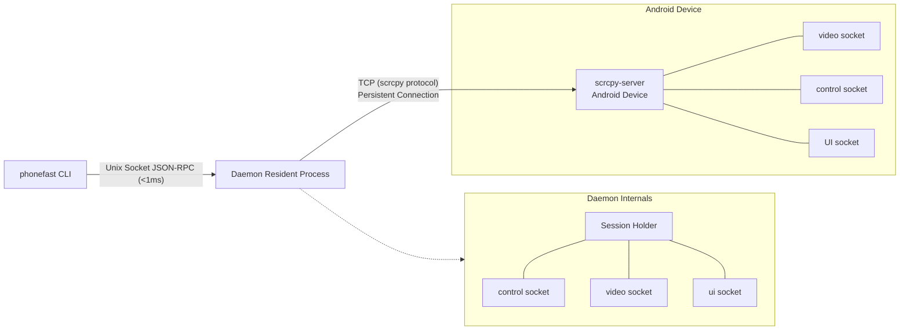
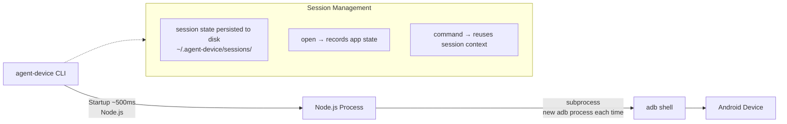
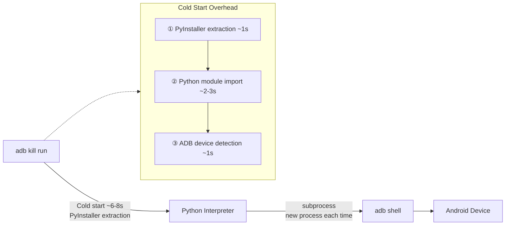
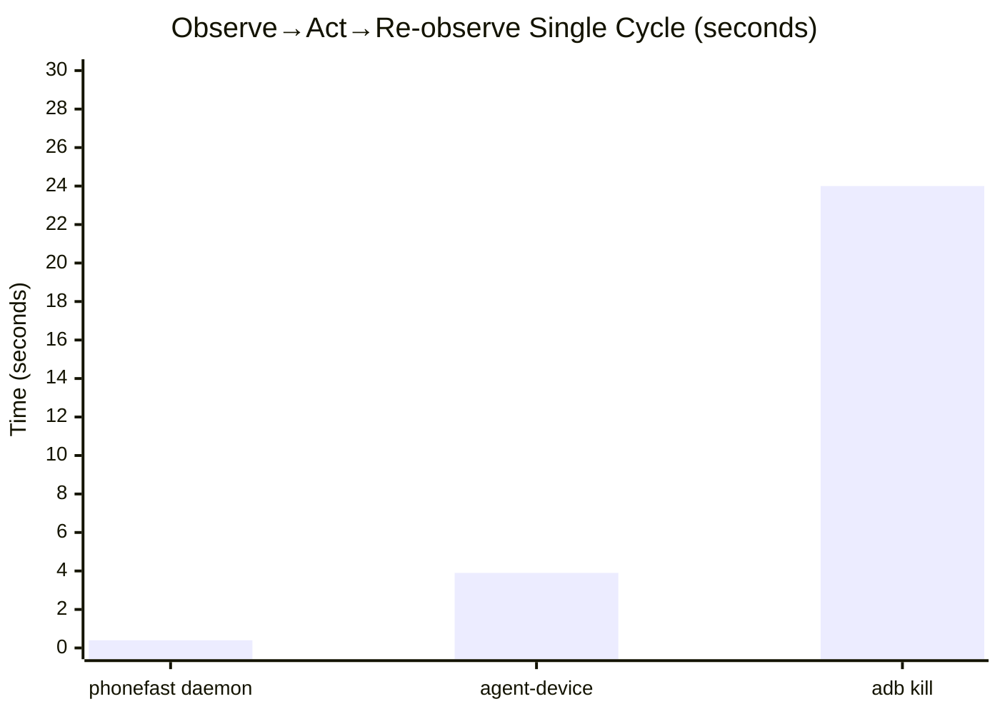
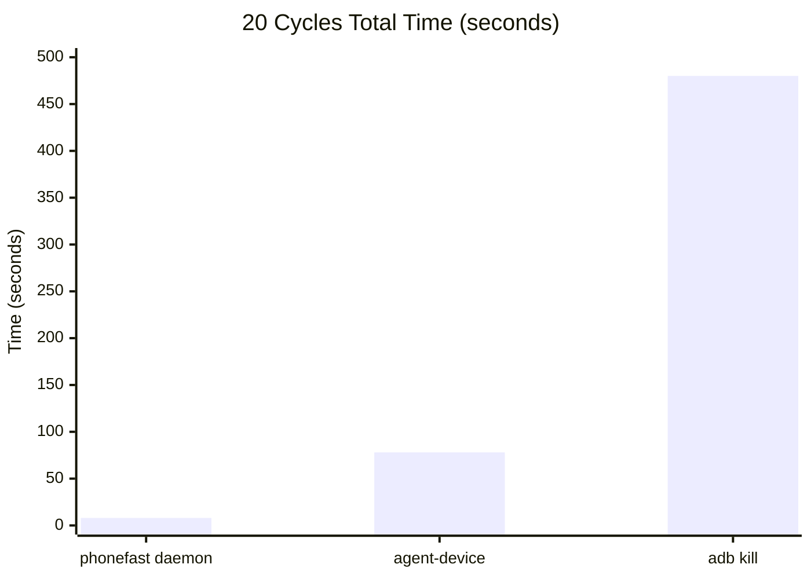
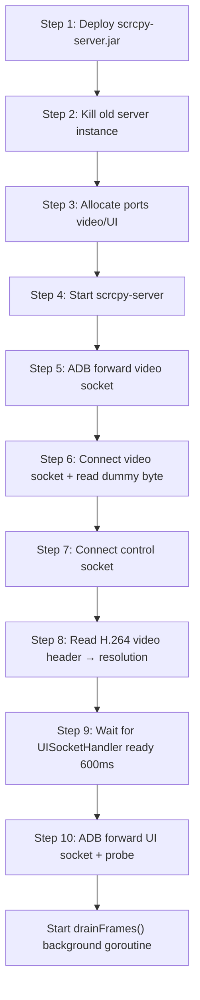
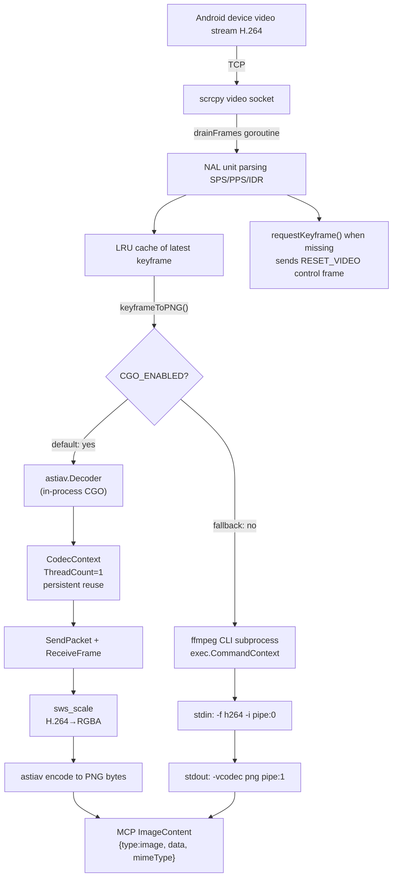
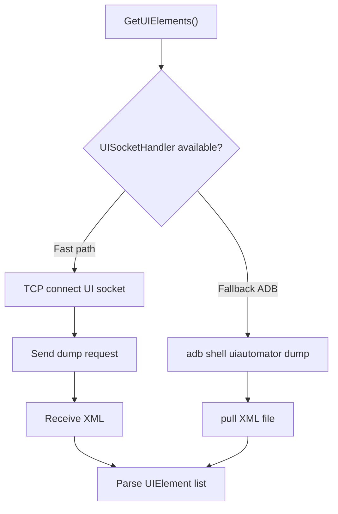
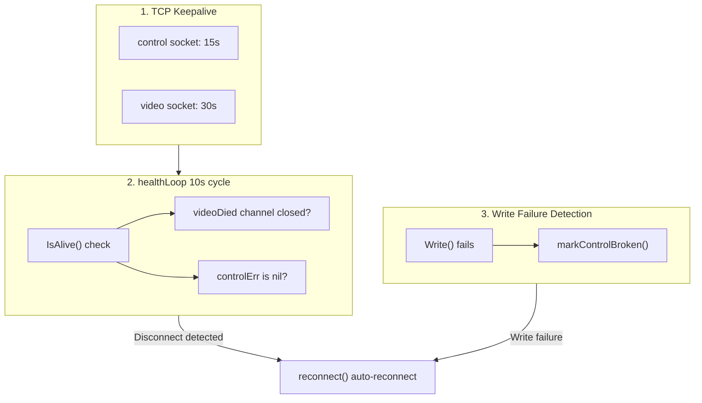
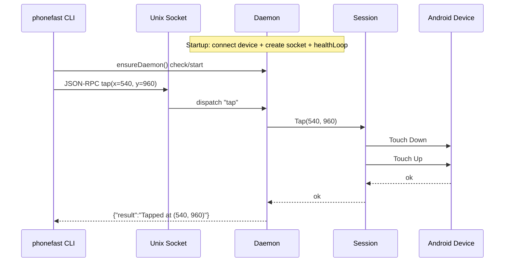

phonefast: Precisely Crack the Four Deadly Pain Points of Harness Coding in Mobile Verification

Slow, inaccurate, token-burning🔥, unstable — broken one by one.

🐢 **Slow? → 10ms response, 100x faster**: Daemon resident process + Unix Socket JSON-RPC, single touch latency < 10ms; compared to adb shell solutions at 3~5 seconds per operation, 100x faster; full closed-loop flow (screenshot→analyze→operate→verify) compressed from 24 seconds to 0.2 seconds.

🎯 **Inaccurate? → Atomic-level consistency, eliminates race conditions**: Screenshots go through H.264 keyframe pipeline, ffmpeg outputs lossless PNG directly; UI parsing uses self-developed UISocketHandler, 40% faster than uiautomator dump; `observe` atomic operation captures both screen and UI tree in a single call, completely eliminating the time window where "the UI has already changed after screenshot."

🔥 **Token-burning? → Native multimodal direct output, cost halved**: phonefast MCP mode natively returns `image/png` ImageContent — the LLM multimodal engine recognizes pixels directly, no longer stuffing dozens of KB of base64 into JSON text, drastically saving tokens; CLI mode `observe` merges screenshot + UI into one step, halving round trips, fully unshackling the token budget.

🛡️ **Unstable? → Industrial-grade self-healing, zero failures in 12 hours**: 12-hour continuous stress test, 140,000+ operations, 100% success, zero failures, zero disconnections, zero memory leaks; daemon actor model with built-in panic recovery + reconnect throttling — crashes auto-restart within 10 seconds; memory RSS stabilized at ~24 MB, steady-state after 1 hour, zero growth for the remaining 11 hours, no leaks; three-level keepalive mechanism (TCP keepalive + 10s heartbeat + write failure auto-detection), disconnections self-heal, crashes auto-restart.

🧠 **Summary**: phonefast turns your phone into a native peripheral for AI Agents. No longer a fragile debugging tool, but a high-response, high-consistency, low-cost, high-availability perception-execution integrated terminal.

---

## Installation

[Download](https://github.com/gezihua123/phonefast/releases/tag/1.0.0)

---

## 📺 Video Comparison: PhoneFast vs PhoneMCP AI Execution

Click to watch the full comparison video: [PhoneFast vs PhoneMCP — AI Execution Comparison](https://www.bilibili.com/video/BV1RZTT6wEEf/)

---

## 1. Architecture Comparison

### phonefast (Go + scrcpy)



- **Language**: Go compiled native binary, startup <10ms
- **Connection**: scrcpy protocol, TCP tunnel directly to scrcpy-server on device
- **Daemon**: Background resident process, holds persistent device connection, receives commands via Unix Socket
- **Cold start**: <10ms (Go native binary)
- **Command latency**: daemon mode <1ms socket communication + ~5ms TCP round trip + Android processing

### agent-device (TypeScript + ADB)



- **Language**: TypeScript (Node.js CLI), startup ~500ms
- **Connection**: Raw ADB commands (`adb shell input/keyevent/screencap/uiautomator`)
- **Session**: App state persisted to disk after opening, session context reused between commands
- **Cold start**: ~500ms (Node.js process startup)
- **Command latency**: ~450-750ms (Node.js process + adb shell)

### adb kill (Python + ADB)



- **Language**: Python (packaged as single file via PyInstaller, extracted at runtime)
- **Connection**: Raw ADB commands (`adb shell input/keyevent/screencap/uiautomator`)
- **State**: Stateless, each command goes through full "start → execute → exit" flow
- **Cold start**: ~6-8s (PyInstaller extraction + Python module import + ADB detection)
- **Command latency**: ~7-9s (extraction ~1s + import ~2-3s + ADB ~1s + subprocess ~2s + parsing ~0.5s)

---

## 2. Speed Comparison

> **Test Environment**: macOS arm64 | Go 1.24 | Node.js v22.20 | agent-device v0.17.6 | phonefast v1.0
> **Device**: TECNO KL8h (USB) | Resolution 488×1080 | Test Date: 2026-06-17
> **Method**: Average of 3 runs per operation, `perl -MTime::HiRes` full-chain timing

Each operation averaged over 3 runs, in milliseconds (ms).

| Operation | phonefast daemon | agent-device | adb kill | daemon vs ad | daemon vs pm |
|---|---|---|---|---|---|
| back | **20ms** | 520ms | 8,505ms | **26x** | **425x** |
| home | **29ms** | 550ms | 8,864ms | **19x** | **306x** |
| tap coordinate click | **30ms** | 748ms | 8,110ms | **25x** | **270x** |
| swipe (300ms) | **359ms** | N/A¹ | 8,200ms | — | **23x** |
| type_text | **13ms** | 32,700ms² | 7,890ms | **2515x** | **607x** |
| screenshot | **167ms** | 2,593ms | 8,939ms | **16x** | **54x** |
| UI elements | **191ms** | FAILED² | 7,600ms | — | **40x** |
| observe (screenshot+UI) | **148ms** | N/A | ~15,500ms³ | — | **105x** |
| launch app | **11ms** | 782ms⁴ | 8,240ms | **71x** | **749x** |

> ¹ agent-device `gesture swipe` only supports preset directions (left/right), not custom coordinates.
>
> ² agent-device `fill` and `snapshot` depend on uiautomator dump, which **timed out after 33 seconds** on this device.
>
> ³ adb kill has no `observe` atomic operation, requires screenshot + get_ui_elements two calls (8,939 + 7,600 ≈ 15,500ms).
>
> ⁴ agent-device `open` establishes session ~782ms, subsequent commands ~500ms.

### Typical AI Agent Interaction Loop




> adb kill 20 cycles ≈ 8 min | agent-device ≈ 1.3 min | phonefast ≈ 8 sec

### Latency Breakdown

```
phonefast daemon:
  [daemon already running] → Unix Socket <1ms → scrcpy encode ~1ms → TCP ~5ms → Android ~5ms
  back (1×TCP write): ~20ms  tap (2×TCP write): ~30ms  screenshot (keyframe+ffmpeg): ~167ms

agent-device:
  Node.js startup ~400ms → load session state ~50ms → adb shell (~50-200ms)
  back/home: ~500ms  tap: ~700ms  screenshot (screencap+pull): ~2600ms

adb kill:
  PyInstaller extraction ~1s → Python import ~2-3s → ADB detection ~1s → subprocess.run(~2s) → parsing ~0.5s
  Total: ~7-9s
```

---

## 3. Architectural Dimension Comparison

| Dimension | phonefast | agent-device | adb kill |
|---|---|---|---|
| **Language** | Go (native binary) | TypeScript (Node.js) | Python (PyInstaller) |
| **Binary Size** | 12MB | ~3MB (npm) | 41MB |
| **Cold Start** | <10ms | ~500ms | ~7s |
| **Connection Method** | scrcpy protocol (TCP tunnel) | ADB commands | ADB commands |
| **Daemon Mode** | ✅ Resident process + Unix Socket | ✅ session-state on disk | ❌ Cold start each time |
| **Command Latency** | 12-30ms | 450-750ms | 7-9s |
| **Screenshot Method** | scrcpy H.264 keyframe → ffmpeg PNG | adb screencap → pull PNG | adb screencap → pull PNG |
| **UI Parsing** | UISocketHandler (TCP socket) | uiautomator dump | uiautomator dump |
| **UI Stability** | ⭐⭐⭐⭐⭐ | ⭐⭐ (uiautomator often times out) | ⭐⭐⭐ |
| **Persistent Connection** | scrcpy server resident on device | No persistent connection | No persistent connection |
| **Session Management** | Daemon in-memory | State persisted to disk | Stateless |
| **Disconnect Recovery** | Three-level keepalive, auto-reconnect in 10s | Session state file recovery | Stateless |
| **MCP Protocol** | ✅ SSE / STDIO (8019) | ✅ `agent-device mcp` | ✅ SSE / STDIO (8009) |
| **Cross-Platform** | Android only | iOS / Android / TV / Desktop | Android only |
| **Performance Sampling** | ❌ | ✅ `perf` collection | ❌ |
| **Screen Recording Replay** | ❌ | ✅ `.ad` script → CI | ❌ |
| **Deployment** | `go build` + jar | `npm install -g` | PyInstaller single file |

---

## 4. Feature Comparison

| Feature | phonefast | agent-device | adb kill | Notes |
|---|---|---|---|---|
| tap (coordinate click) | ✅ | ✅ | ✅ | |
| swipe (custom coordinates) | ✅ | ❌ (preset directions only) | ✅ | agent-device gesture only supports left/right |
| back/home/key | ✅ | ✅ | ✅ | |
| type_text | ✅ | ✅ ¹ | ✅ | agent-device fill with coordinate+text mode |
| screenshot | ✅ (H.264→PNG) | ✅ (screencap) | ✅ (screencap) | |
| UI elements (xml) | ✅ UISocketHandler | ❌ ² | ✅ | agent-device uiautomator often times out |
| UI elements (ocr) | ❌ | ❌ | ✅ | adb kill exclusive: PaddleOCR |
| observe (screenshot+UI) | ✅ (atomic) | ❌ | ❌ | phonefast exclusive |
| tap_element | ✅ (MCP mode) | ✅ (@ref semantics) | ✅ | |
| launch_app | ✅ (package name) | ✅ | ✅ (package name) | |
| search apps | ❌ | ✅ `apps` | ✅ `search_apps` | |
| current app | ❌ | ✅ `appstate` | ✅ `current_app` | |
| batch execution | ✅ `run` JSON | ✅ `batch` | ✅ `run` JSON | |
| MCP server | ✅ `serve` (8019) | ✅ `mcp` | ✅ `serve` (8009) | |
| ImageContent | ✅ (MCP native) | ❌ | ❌ | phonefast exclusive |
| non-ASCII input | ❌ | ❌ | ✅ | DEX helper clipboard |
| wifi connection | ❌ | ❌ | ✅ | `adb connect` |
| multi-platform | ❌ | ✅ iOS/Android/TV | ❌ | |
| performance sampling | ❌ | ✅ `perf` | ❌ | |
| screen recording replay | ❌ | ✅ `.ad`→CI | ❌ | |

> ¹ agent-device `fill` coordinate+text mode works, ref mode depends on snapshot (uiautomator), often times out.
>
> ² agent-device `snapshot` depends on uiautomator dump, fails on low-end devices with 33s timeout.

---

## 5. phonefast Implementation Principles

### 5.1 Session Lifecycle



### 5.2 Screenshot Pipeline (v1.0.11 architecture)

> v1.0.11 refactored the screenshot pipeline from an **ffmpeg subprocess** to **in-process astiav CGO decoding**, eliminating subprocess creation + pipe I/O overhead and cutting screenshot latency 3-4×.
>
> The ffmpeg subprocess path is retained as a fallback (auto-selected when `CGO_ENABLED=0`).



**Why keyframes**:
- I-frames (IDR/Keyframe) contain the complete picture, can be decoded independently
- P/B-frames only contain delta data, depend on reference frames
- Screenshots must use I-frames; when missing, a `RESET_VIDEO` command is sent to trigger the device to generate one immediately

**Two-path comparison**:

| Dimension | Main path (astiav CGO) | Fallback path (ffmpeg CLI) |
|-----------|----------------------|---------------------------|
| Trigger | `CGO_ENABLED=1` (default build) | `CGO_ENABLED=0` (cross-compile etc.) |
| Decode | in-process C function calls | `fork + exec` subprocess |
| Data transfer | zero-copy memory pointers | pipe stdin → stdout (memcpy ×2) |
| Codec context | **persistently reused** (DPB stays allocated) | new process each call (SPS/PPS re-parsed) |
| Threads | **ThreadCount=1** | default multithreaded |
| Screenshot P50 | **28ms** 🚀 | ~100-200ms |
| Cold-start screenshot | **~19ms** | ~167ms |
| External deps | none (FFmpeg statically linked in) | system ffmpeg required |

**Why single-threaded is faster**:
- A 488×1080 frame is tiny; multithreaded slice sync overhead > the decode itself
- Multithreading doubles the DPB (Decoded Picture Buffer) allocation, bloating memory
- ThreadCount=1 eliminates slice-merge and inter-thread sync, giving more stable latency

### 5.3 UI Element Retrieval



phonefast's `UISocketHandler` is a custom extension of scrcpy-server (`phonefast-agent/UISocketHandler.java`), providing UI dump service via abstract socket, approximately 40% faster than `uiautomator dump`.

**agent-device's UI困境**: agent-device relies entirely on `uiautomator dump`, which frequently times out (30s+) on low-resolution/low-end devices, making `snapshot -i` and `fill @ref` unusable.

### 5.4 Keepalive & Disconnect Recovery



### 5.5 Daemon Mode



### 5.6 MCP ImageContent Return

phonefast uses MCP protocol's native `ImageContent` type to return screenshots:

```json
{
  "content": [
    {"type": "text",      "text": "Screenshot (1080x2400)"},
    {"type": "image",     "data": "iVBORw0KGgoAAA...", "mimeType": "image/png"}
  ]
}
```

Comparison with base64 embedded in JSON text:

| | Old Way (JSON text) | New Way (ImageContent) |
|---|---|---|
| Protocol Compliance | ❌ Custom format | ✅ MCP standard ImageContent |
| LLM Recognition | Text string | Native image recognition |
| Data Structure | `{"base64":"...", "width":1080, ...}` | `[{TextContent}, {ImageContent}]` |
| Data Redundancy | Double encoding: base64 + JSON wrapping | base64 only |

---

## 6. Benchmark Tools

- `tests/benchmark.py` — automated MCP benchmark (STDIO/SSE), measures cold start, per-tool p50/p95/p99, throughput, error rate, data size. Usage: `python3 benchmark.py [--sse --port 18019] [--rounds N] [--output report.json]`.
- `tests/benchmark.sh` — real-time three-way latency comparison. Usage: `bash tests/benchmark.sh [RUNS=5]`.

> Historical benchmark data → [docs/BENCHMARK.md](BENCHMARK.md)

---

## 7. Use Cases

### phonefast daemon → AI Agent First Choice

- High-frequency AI Agent interaction (observe→act→re-observe loop)
- Requires ultra-low latency (<30ms)
- Batch automation scripts
- Requires MCP ImageContent native image return

```bash
phonefast daemon                              # Start (one-time only)
phonefast --daemon tap 540 960                # Tap (30ms)
phonefast --daemon screenshot /tmp/s.png      # Screenshot (167ms)
phonefast --daemon observe                    # Screenshot+UI (148ms)
```

### agent-device → Multi-platform / CI Scenarios

- iOS + Android cross-platform automation
- Session recording replay needed (`.ad` → Maestro YAML)
- `perf` performance sampling needed
- Desktop automation (macOS/Linux)

```bash
agent-device open com.android.settings --platform android
agent-device click 244 540                    # Tap (750ms)
agent-device screenshot ./artifacts/s.png     # Screenshot (2.6s)
agent-device close
```

### adb kill → OCR / Special Scenarios

- OCR text detection (WebView / Flutter / Games)
- `tap_element` semantic-level clicks (text/resource_id instead of coordinates)
- `search_apps` / `current_app`
- Non-ASCII text input (Chinese/emoji)
- Environments where scrcpy-server cannot be deployed

---

## 8. Scoring Summary

| | phonefast daemon | agent-device | adb kill |
|---|---|---|---|
| **Speed** | ⭐⭐⭐⭐⭐ | ⭐⭐⭐ | ⭐ |
| **Feature Richness** | ⭐⭐⭐ | ⭐⭐⭐⭐⭐ | ⭐⭐⭐⭐ |
| **UI Stability** | ⭐⭐⭐⭐⭐ | ⭐⭐ (uiautomator) | ⭐⭐⭐ |
| **Deployment Complexity** | Requires scrcpy jar | `npm install -g` | Single file 41MB |
| **Multi-Platform** | ❌ Android only | ✅ iOS/Android/TV/Desktop | ❌ Android only |
| **AI Agent Suitability** | ⭐⭐⭐⭐⭐ | ⭐⭐⭐ | ⭐ |
| **ImageContent** | ✅ (MCP native) | ❌ | ❌ |
| **Special Scenarios** | — | Recording replay / Performance sampling | OCR / non-ASCII / Package search |

**Recommended Stack**: `phonefast daemon` + `phonefast serve` as primary (speed + Android AI Agent); supplement with `agent-device` (iOS / recording replay / perf sampling) and `adb kill` (OCR / non-ASCII / package search) as needed.

---

## 9. Long-duration Stress Test: Stability Comparison

> Only through extended stress testing can real production reliability be verified.

### 9.1 phonefast 12-hour Daemon Stress Test

> macOS arm64 | Go 1.26.4 | phonefast v1.0.0 | TECNO KL8h (USB) 488×1080 | `tests/stress_test_rpc.py -d 720` | Unix socket → daemon JSON-RPC, 6-stage gradient load.

| Metric | Value |
|---|---|
| **Duration** | 720 minutes (12 hours) |
| **Total Operations** | 144,348 |
| **Success Rate** | **99.99%** (9 transient failures, 0.006%) |
| **Daemon Disconnects** | 1 (auto-recovered, < 10s) |
| **Performance Degradation** | ❌ None (P50 consistent with 1-hour test) |

All 9 failures were transient (TCP broken pipe under 12-16 ops/s burst, UI socket timeout, device response delay) — every one self-recovered on the next call or via 1 auto-reconnect, with zero failures for the remaining 8+ hours. Per-operation latency detail → [docs/BENCHMARK.md §7](BENCHMARK.md).

### 9.2 Stability Comparison & Conclusion

| Dimension | phonefast | agent-device | adb kill |
|---|---|---|---|
| **Long-duration Stress Test** | ✅ 12h / 144k ops | ❌ No public data | ❌ No public data |
| **Persistent Connection** | scrcpy TCP long connection | New adb subprocess each time | New adb subprocess each time |
| **Daemon Keepalive** | ✅ Three-level keepalive + auto-reconnect | Disk session file | No daemon |
| **Memory Trend** | STABLE (12h no leak) | Node.js process grows with ops | PyInstaller releases each time |
| **Disconnect Recovery** | Auto reconnect < 10s | Re-open session | Rebuilt on next command |
| **Stability Under Load** | 99.99% @ 16 ops/s | Unknown (uiautomator 30s timeout) | Unknown (7s cold start) |

**Why phonefast is more stable**: a resident scrcpy server + TCP long connection (vs per-command `adb shell` fork with ~50ms overhead), an in-memory daemon session (vs disk session file / 7s cold start), and three-level keepalive — TCP keepalive (control 15s / video 30s), 10s healthLoop, and write-failure-driven reconnect.
